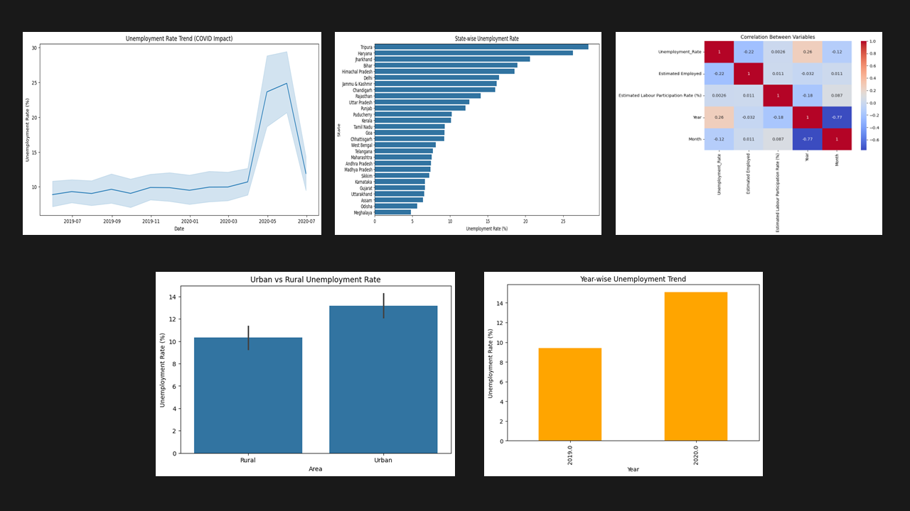

# Unemployment Analysis Using Python

Horizon TechX Data Science Internship — Task 2

## 📌 Project Overview

This project analyzes unemployment trends in India using Python and explores the impact of COVID-19 on employment patterns across different states and regions. The analysis focuses on unemployment rates, labour participation rates, employment levels, and regional disparities to derive meaningful insights that can support economic and policy-level decision-making.

## 📸 Project Preview

Exploratory Data Analysis (EDA) Dashboard

* Unemployment Trend Over Time
* State-wise Unemployment Analysis
* Urban vs Rural Comparison
* Year-wise Unemployment Trends
* Correlation Analysis
* COVID-19 Impact Assessment

## 📸 Dashboard preview
<h2>📸 Dashboard Preview</h2>

  

## 📁 Project Structure

Unemployment-Analysis-COVID/
│
├── data/
│   ├── Unemployment in India.csv
│
├── notebooks/
│   ├── data_cleaning.ipynb
│   ├── eda_analysis.ipynb
│
├── src/
│   ├── data_loader.py
│   ├── analysis.py
│   ├── visualization.py
│
├── outputs/
│   ├── graphs/
│
├── requirements.txt
│
└── README.md

## 📊 Steps Covered

### Data Cleaning

* Loading the dataset
* Handling missing values
* Standardizing column names
* Converting Date column to datetime format

### Exploratory Data Analysis (EDA)

* Unemployment Trend Analysis
* State-wise Comparison
* Urban vs Rural Analysis
* Year-wise Trend Analysis
* Labour Participation Analysis
* Correlation Analysis

### COVID-19 Impact Analysis

* Identification of unemployment spikes during the pandemic
* Comparison of unemployment patterns across regions
* Recovery trend analysis

## 📊 Visualizations Included

### EDA Dashboard

* Unemployment Rate Trend Over Time
* Top States by Unemployment Rate
* Urban vs Rural Unemployment Comparison
* Year-wise Unemployment Analysis
* Labour Participation vs Unemployment Rate
* Correlation Heatmap

## 🛠️ Libraries Used

* Python 3
* Pandas
* NumPy
* Matplotlib
* Seaborn
* Jupyter Notebook

## 🚀 How to Run

### Option 1 — Jupyter Notebook

1. Clone or download the repository.
2. Install required libraries:

pip install -r requirements.txt

3. Open the notebooks folder.
4. Run:

   * 01_data_cleaning.ipynb
   * 02_eda_analysis.ipynb

### Option 2 — VS Code

1. Open the project folder in VS Code.
2. Activate your virtual environment.
3. Install dependencies:

pip install -r requirements.txt

4. Run the notebooks sequentially.

## 📂 Dataset Source

Kaggle Dataset: Unemployment in India

Dataset Features:

* Region
* Date
* Frequency
* Estimated Unemployment Rate (%)
* Estimated Employed
* Estimated Labour Participation Rate (%)
* Area

## 🔑 Key Findings

* Unemployment increased significantly during the COVID-19 period.
* Certain states consistently exhibited higher unemployment rates than others.
* Urban and rural regions showed different unemployment patterns.
* Labour participation rate demonstrated a relationship with unemployment levels.
* Gradual recovery trends were observed after the peak pandemic period.
* COVID-19 had a substantial impact on employment opportunities across India.

## 📈 Conclusion

The analysis demonstrates that COVID-19 significantly affected unemployment trends in India. By examining regional patterns, labour participation, and employment indicators, the project provides valuable insights into labour market dynamics and economic recovery trends. These findings can help policymakers and researchers better understand employment challenges and develop informed strategies for workforce development.

## 👤 Author

Akanksha Srivastava
Data Science Intern
GitHub: https://github.com/khushigithub1

LinkedIn: https://www.linkedin.com/in/akanksha-srivastava-20a43623b/

## 📄 License

This project is created for educational and internship purposes.
